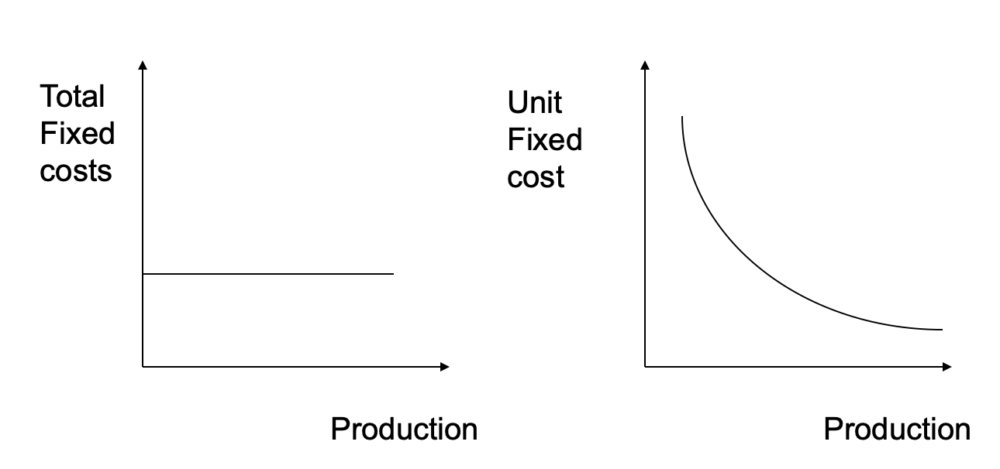
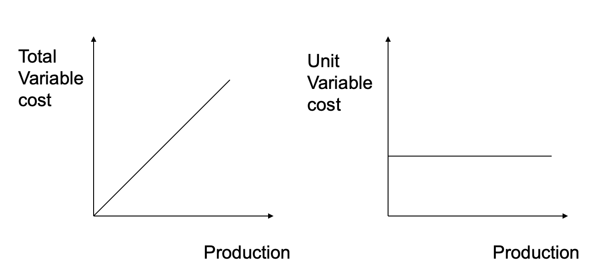

# Marketing

É uma atividade, conjunto de instituições, de organizações e processos, para criar, comunicar e entregar uma relação de troca onde existe valor.

A gestão de marketing, segundo Kotler, é uma análise, planeamento, implementação e controlo de programas para uma determinada audiência alvo com benefícios para ambas as partes. É necessário haver adopção dos 4Ps (*marketing mix*):

- Product;
- Price;
- Promotion (comunicação);
- Place (distrbuição);

É necessário conhecer e compreender os clientes, para que o marketing resulte em clientes prontos a comprar o produto (seja ele um serviços, eventos, lugares, pessoas, ideias, entre outros).

Os markets são grupos de clientes e podem ser:

- `Consumer markets`, normalmente clientes finais;
- `Business markets`, como companhias ou redes de entidades, cuja compra é a nível profissional;

Existe uma diferenciação entre strategical e tactical marketing:

- `strategic`: customer segments, target market, positioning;
- `tactical`: product/service, price, production, distribution, promotion sales, advertising;

### Marketing Mix (7Ps)

#### 1 - Product

Tudo que é palpável é um produto, o resto é serviço. A diferença entre produto e serviços puros é que os puros são algo isolado, ao contrário dos produtos, onde oferecem benefícios e uma atmosfera adicional.

#### 2 - Price

É uma importante decisão que deve ser estratégica, estimada com base em custos. Está na base de Penetration strategy.

#### 3 - Promotion

Comunicar para promover a companhia para potenciar clientes. Promoções, redes sociais, publicidade.

#### 4 - Place

A distribuição para o cliente final. Pode ser multichannel e Omni channel.

#### 5 - People

O contacto pessoal é importante para garantir que os clientes são bem tratados, tendo uma boa experiência.

#### 6 - Process

O processo torna a gestão do marketing muito mais eficiente, expectando os momentos de contacto com os clientes e o flow que este tem.

#### 7 - Physical

É o estilo e o ambiente visual que providencia o impacto inicial do produto ou serviço.

## Segmentation

O primeiro passo do processo `STP`:

- Segmentation;
- Target;
- Posicionamento;

É necessário haver uma segmentação do mercado para corresponder a necessidades específicas dos clientes, que são sempre diferentes. É necessário identificar grupos de customers com preferencias semelhantes. 

### Level Segmentation

O mercado pode ser segmentado em quatro níveis:

- `Mass marketing`: desenvolve apenas um marketing mix, para um mercado global; 
- `Segment marketing`: desenvolve soluções adaptadas para uma necessidade específica, para um segmento do mercado;
- `Niche-marketing`: para um pequeno segmento de utilizadores de necessidades muito específicas;
- `Marketing one-to-one`: específicas para determinados clientes, individualistas;

### Segmentation variables

- `Geographic`;
- `Socio-demographic`: age, gender, income, status, education;
- `Psycographic`: lifestyle, ideals, self-expression;
- `Behavioral`: knowledge, attitude, use and response to a product;

De qualquer forma, um segmento de mercado deve ser medível, substancial, acessível, ter um diferencial e ser acionável/reacionável ao produto.

Existe também **individual marketing**, onde serviços tradicionais proporcionam uma personalização por parte dos clientes, como por exemplo o Spotify.

## Market Targeting

Após identificar os segmentos, é necessário escolher alguns para poder atuar: os targets. Pode ser:

- `Single segments`: apenas um segmento;
- `Selective specialization`: alguns segmentos, não necessariamente interligados;
- `Product specialization`: o mesmo produto base para vários mercados;
- `Market specialization`: vários produtos para o mesmo mercado;
- `Full market coverage`;

## Positioning

É o ato de descrever a imagem da companhia e o que esta tem para oferecer. Reflete a estratégia da companhia. Existem dois pontos essenciais:

- `Points of difference`: atributos que estão associados ao que o produto oferece, que não podem ser encontrados na concorrência;
- `Points of parity`: atributos que não são necessariamente únicos, que podem ser partilhados com outras marcas, por exemplo, requisitos globais para um hotel de quatro estrelas;

Existe um `Positioning statement`:

> Among (target market), our offering [Brand name] is the brand of (frame of reference) that (point of difference) because (reason to believe).  

## Value Proposition

Estratégia de marketing que acaba por apresentar um conjunto de benefícios em forma de promessa às empresas target, assim como a sua posição para a solução pretendida. Apresentação de **benefícios** e **custos** em forma de valor. O valor pode ser:

- `Funcional`: benefícios e custos diretos, como performance, durability, entre outros;
- `Psycological`: benefícios emocionais;
- `Monetary`: como cash-back, tudo a nível financeiro;
- `Total customer benefit`: conjunto de benefícios;
- `Total customer cost`: conjunto de custos;
- `Customer value proposition`: diferença entre os benefícios que o customer tem e o custo que ele assume, o lucro no fundo;

A atração dos clientes para o produto, de forma a eles experimentarem e quererem, é um passo importante para o Marketing:

### Customer Acquisition Funnel

1. **Awareness** - interação do customer com a oferta, utilizando comunicação para a aproximação;
2. **Appeal** - processo de eliminação seletiva de produtos após a etapa anterior;
3. **Ask** - os customers procuram mais informação do produto, através de external sources ou reviews;
4. **Act** - ação após oferta, não está limitada à compra, mas sim à total experiência de utilização, atual e futura;

Este funil ou esquema não é linear, e pode derivar de uma compra impulsiva. Customers podem falar das ofertas mas não necessariamente comprar.

Há outros tópicos a considerar:

- `Customer retention`;
- `Customer expectations`;
- `Customer satisfaction`;
- `Customer loyalty`: conseguido através de interactions, loyalty programs (cupões do continente) ou brand communities (clubes de futebol). Mesmo que a marca mude alguma coisa, dificilmente os clientes mudam para a concorrência;

## CRM - Customer Relation Management

Processo de gestão de informação sobre os customers em diferentes pontos de entrada. O objectivo é criar e entregar um maior valor para os target customers, com base na informação que eles transmitem. Há três tipos de CRM:

#### 1 - Strategic CRM

Onde o cliente é sempre central, desenvolvendo uma cultura de escuta dos customers, para entregar mais um value propositions. A informação do customer é partilhada entre departamentos.

#### 2 - Operational CRM

Automação e integração de processos para os customers, como dar ferramentas e informação, como saldos, e customer services. Tem relação com o software, que são melhorados para uma melhor experiência e performace com base nos utilizadores.

#### 3 - Analytical CRM

Processo de captura dinâmica de dados dos utilizadores, para melhorar o valor dado aos targets.

### Customer Lifetime Value (CLV)

O objectivo do CRM é aumentar o Customer Lifetime Value, ou seja, a equivalência monetária que o customer dará à companhia durante o seu tempo útil na empresa. 

#### Calculation

CLV = Sum (i -> [0..t]) ((pt - ct) / (i + 1)^t) - AC

> pt : preço pago pelo customer  
> ct : cost de servir o customer  
> i : discout rate  
> rt : probability of customer repeat buying  
> t : time horizon for estimating CLV  
> AC : Aquisition Cost  

## Marketing Pricing

Existem custos físicos e custos variáveis. 

Tudo isto para aferir o `Break-even point`, ou seja, o ponto que determina o número mínimo de vendas de produtos unitários de modo a conseguir lucro. Cálculo:

> Break-even point = Total Fixed Costs / Unitary Variable Margin  

Por exemplo, se tivermos custos fixos de 29000 euros e um lucro de 23,5 euros por unidade, o break-even point será de 1235 encomendas. A partir desse valor estrutura da empresa dá lucro.